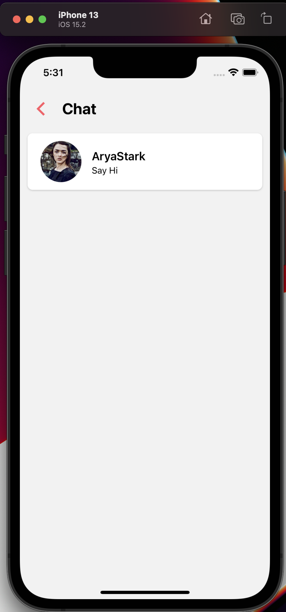

# Tinder Clone
Building a Tinder clone using React Native and Typescript with the following features:
- Google Sign-in
- Chat Messaging
- Swipe-able cards with swipe animations
- Matching algorithm using Firestore as a persistence layer

## Tech Stack
- Tailwind CSS
- Jest
- Firebase
- React Native CLI
- Circle CI 

## Set-up
Configure firebase using the following guide:
https://rnfirebase.io/

Create a `.env` file based on `.env.sample`

Install dependencies
```bash
npm install
```
Start application

```bash
npm start
```

Run app
```bash
npm run ios
```
```bash
npm run android
```

## Demo

###Main Screen


###Match


###Chat



